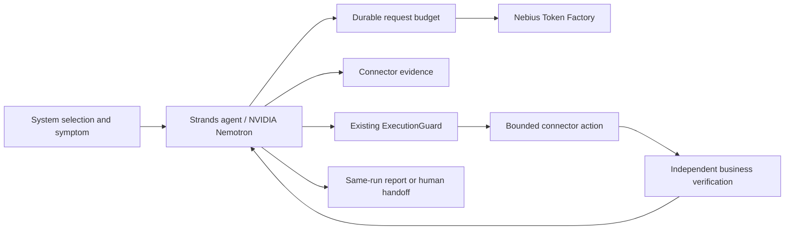

# Architecture and capability boundaries

`Connector` supplies system identity, action descriptions, reads, bounded execution and recovery
verification. The agent core has no order-sync, HTTP-fault or job-fault decision table. A new
system supplies a connector and its configuration; it does not require a new agent loop.
The test harness chooses controlled fault conditions; those fault names/answers are not sent
to the model. The user description is identical for each paired symptom.

The selected NVIDIA model explains the evidence, chooses tools and actions, and changes its
decision when the evidence changes. The program controls permissions, supported parameters,
request and action limits, execution ownership, cancellation and verification. Logs are
untrusted data. There is no arbitrary shell, process ID, path, URL or production action tool.

The existing C04 `ExecutionGuard`, `SafetyPolicy` and single-use execution capabilities are
reused with a connector-specific immutable catalog. The historical C04 catalog and simulator
remain unchanged. All new executable actions are bounded low-risk operations on owned test
resources; unsupported/high-risk production actions have no executor.

The IncidentPilot arm synchronously verifies after each executed mutation and returns that
real observation to the model. It does not select the next action. The generic-agent comparison
uses the same model, tools, permissions, guard and limits, with a generic prompt and explicit
verification calls. Every final report performs the same independent business check.

Report schema v2 keeps original provider tool call IDs and arguments, linked read evidence,
guard results, verification results and cost reservations in one run directory. Legacy v1 JSON
is readable without migration; historical accepted traces are never rewritten or relabelled.
Model-written explanations are interpretations; recovery status comes from the connector check.

Test resources:

- HTTP application: an actual loopback TCP listener serves a synthetic catalog. Restart affects
  the listener. Dependency restoration changes application behavior. Verification checks HTTP
  status, instance identity and catalog content, so a successful restart returning 503 still fails.
- Background worker: an actual queue/worker thread processes a synthetic input and writes a
  current-job artifact. Clearing a lock does not rerun the job. Verification checks status,
  job identity, input digest and independently computed output; stale/corrupt files fail.

These are deliberately small local owned services, not enterprise integrations or a production
reliability benchmark. The connector contract is extensible but no production connector is claimed.
There is no long-running availability SLA. No AWS Bedrock evidence is claimed.
